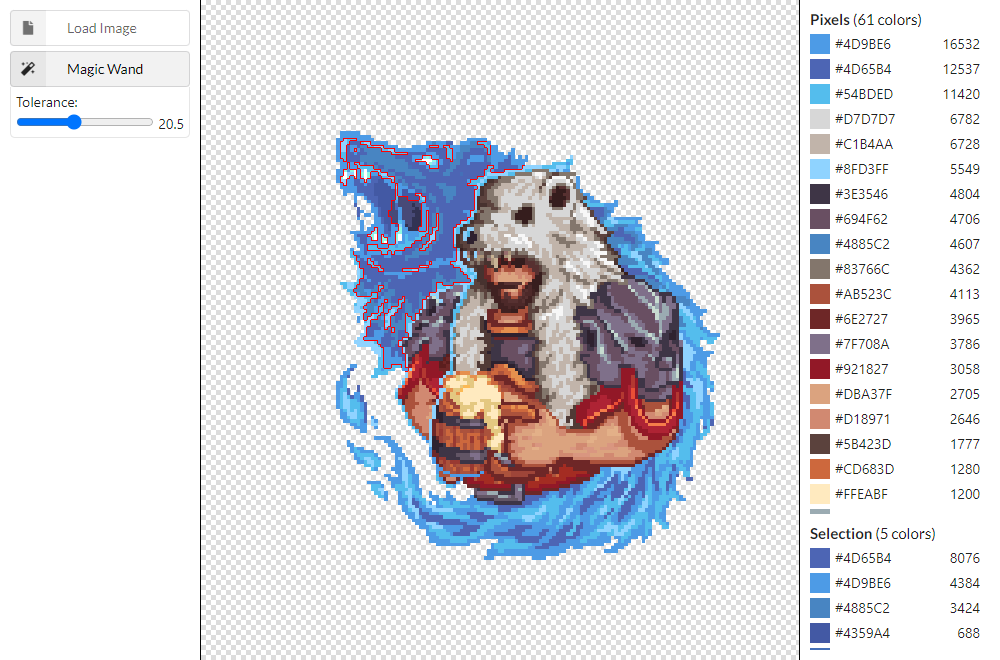
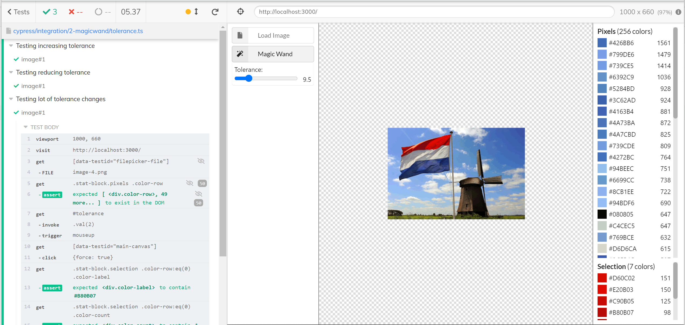

# Frontend Engineer Test: Magic Wand

Try it out! [magicwand-test/master/build/index.html](https://rawcdn.githack.com/fiote/magicwand-test/master/build/index.html?t=1)

### Description

A canvas tool that allows you to select an image and then run a "magic wand" script on it, selecting an area around a pixel/position based on the similarity of colors.

### Changelog

First version was made using pure javascript. No react nor tests, just to see if I could make a magic wand tool.

Assuming this could become something bigger, I added a few UI features when 'porting' it to React and tried my best to split it in components to make the maintenance easier and features (mostly) independent of each other.

Also, since most features depend on canvas manipulation, jest could not really help me test if they were doing what they're supposed to, so I picked Cypress to do some visual/function testing.

### Technologies

React with Typescript, Canvas, Cypress.